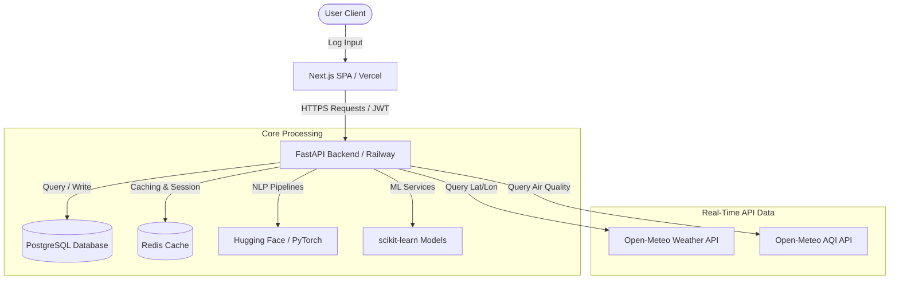

# SoulSync — Complete Master Project Blueprint

> **Tagline:** Understand your patterns. Sync with yourself.

---

## 1. Project Overview & Concept
**SoulSync** is a full-stack, AI/ML-powered mental wellness and self-reflection platform. It provides users with a safe digital space to log mood, sleep, stress, energy levels, journal entries, and habits. 

Rather than functioning as a diagnostic tool, SoulSync focuses on **pattern observation** and **correlation tracking**, synthesizing data into a central innovative feature:
### 🧠 The Personal Wellness Digital Twin
A dynamic, mathematical representation of a user’s self-reported wellness states. It uses unsupervised clustering and anomaly detection algorithms to identify behavioral cycles (e.g., *Balanced Pattern*, *High-Stress / Low-Energy Pattern*, *Recovery Pattern*), phrasing all outputs as correlations rather than absolute clinical diagnoses.

> [!IMPORTANT]
> **Responsible AI Boundary:** SoulSync is **not** a medical diagnosis tool. It does not screen for, label, or treat depression, anxiety, or other psychiatric conditions. Highly critical text triggers standard crisis helpline references without clinical categorization.

---

## 2. Platform Architecture & Data Flow



---

## 3. Explicit Data Layer Tiers

To keep data boundaries clear and secure, SoulSync segregates data into three distinct tiers:

### 📊 Tier A: Offline Training Datasets
Used exclusively for research, baseline feature engineering, and offline model training. These datasets are **never** mixed into live user database tables.
1. **[GoEmotions Dataset](https://github.com/google-research/google-research/blob/master/goemotions/README.md):** 58k Reddit comments labeled with 28 emotions. Used to pre-train our DistilBERT journal classifier. We note a domain mismatch (informal Reddit threads vs. private journals) and run evaluations on a validation set.
2. **[StudentLife Dataset](https://studentlife.cs.dartmouth.edu/):** 10 weeks of continuous sensor and EMA data from Dartmouth students. Used offline to design our feature engineering schemas and test initial clustering boundaries.
3. **[WESAD (Stress & Affect) Dataset](https://archive.ics.uci.edu/dataset/465/wesad+wearable+stress+and+affect+detection):** Multi-sensor physiological signals (wrist/chest). Kept as an optional Phase 2 dataset for wearables integration research.

### 📝 Tier B: Runtime User-Generated Data
Private data generated by the user through active participation, stored securely in the PostgreSQL database.
* **Daily Logs:** Mood, stress, energy (1-10 scores), sleep duration, and context tags.
* **Reflection Journals:** Rich text analyzed by the NLP engine to generate sentiment scores (`-1.0` to `+1.0`) and theme tags.
* **Engagement Signals:** Activity completions, habit tracking grids, and helpfulness feedback ratings.

### 🌐 Tier C: Real-Time API Data
Dynamically fetched at the runtime check-in window based on user geolocation consent.
* **[Open-Meteo Weather API](https://open-meteo.com/en/docs):** Collects temperature, apparent temperature, relative humidity, cloud cover, and UV index.
* **[Open-Meteo Air Quality API](https://open-meteo.com/en/docs/air-quality-api):** Collects PM2.5, PM10, and US/European AQI.

---

## 4. Machine Learning & AI Pipelines

SoulSync integrates five modular models to drive the insight engine:

| Model | Algorithm | Input | Output / Stored Feature |
| :--- | :--- | :--- | :--- |
| **1. Emotion Classifier** | Fine-Tuned DistilBERT | Journal Text | 6 Emotion probabilities (Happy, Sad, Anxious, Angry, Calm, Neutral) |
| **2. Sentiment Analyzer** | Lexicon + VADER Fallback | Journal Text | Continuous score from `-1.0` (Negative) to `+1.0` (Positive) |
| **3. Trend Predictor** | Random Forest Classifier | 3-day / 7-day rolling aggregates | Multi-class prediction: *Improving*, *Stable*, or *Declining* |
| **4. Digital Twin** | K-Means Clustering | Sleep, Mood, Energy, Stress vectors | Cluster Assignment (e.g., *High-Stress / Low-Energy Pattern*) |
| **5. Anomaly Detector** | Isolation Forest | Newest log vs. Historical array | Binary flag (`1` = normal, `-1` = deviation anomaly) |

---

## 5. Technology Stack

* **Frontend:** [Next.js](https://nextjs.org/) (App Router), [TypeScript](https://www.typescriptlang.org/), [Tailwind CSS](https://tailwindcss.com/), [shadcn/ui](https://ui.shadcn.com/), [Motion](https://motion.dev/) (Animations), [Recharts](https://recharts.org/) (Data Visuals).
* **Backend:** Python, [FastAPI](https://fastapi.tiangolo.com/), [Pydantic](https://docs.pydantic.dev/) V2, [SQLAlchemy](https://www.sqlalchemy.org/) (ORM), [Uvicorn](https://www.uvicorn.org/) (ASGI).
* **AI & NLP:** [PyTorch](https://pytorch.org/), [Hugging Face Transformers](https://huggingface.co/docs/transformers/index).
* **ML & Processing:** [scikit-learn](https://scikit-learn.org/stable/), Pandas, NumPy, Joblib.
* **Database & Cache:** PostgreSQL (Data persistence), Redis (API rate limiting & session storage).
* **Infrastructure:** Docker, Docker Compose, Vercel (Frontend), Railway/Render (Backend/Databases).

---

## 6. Directory Structure Mapping

```text
soulsync/
├── frontend/                     # Next.js SPA
│   ├── app/
│   │   ├── (auth)/               # login, register, forgot-password
│   │   ├── onboarding/           # profile setup, weather consent
│   │   └── dashboard/
│   │       ├── page.tsx          # overview cards and recommendations
│   │       ├── check-in/         # slider scoring entries
│   │       ├── journal/          # rich text reflection and NLP views
│   │       ├── sleep/            # duration log and rolling average displays
│   │       ├── insights/         # correlation charts (Sleep vs Mood)
│   │       ├── digital-twin/     # K-Means cluster profiles
│   │       └── settings/         # goals and privacy consent toggle switches
│   ├── components/               # DashboardLayout.tsx sidebar wrapper
│   └── tsconfig.json             # path alias configuration
├── backend/                      # FastAPI REST Service
│   ├── app/
│   │   ├── api/                  # routing (auth, moods, sleep, companion)
│   │   ├── core/                 # security, JWT utility tokens, and configuration
│   │   ├── database/             # session bindings and PostgreSQL connections
│   │   ├── models/               # SQLAlchemy ORM schemas
│   │   ├── schemas/              # Pydantic validation boundaries
│   │   └── services/
│   │       ├── ai_service.py     # DistilBERT NLP classifier & Companion Chat
│   │       └── ml_service.py     # trend forecasting, K-Means, anomaly isolation
│   ├── tests/                    # pytest integration suites
│   ├── main.py                   # FastAPI app entry and database creation triggers
│   └── requirements.txt          # python system packages
├── ml/                           # Modeling & Offline Pipelines
│   ├── data/
│   │   ├── raw/
│   │   ├── processed/            # mapped StudentLife arrays
│   │   └── synthetic/            # generated mock check-ins
│   ├── generate_synthetic.py     # mock data generator
│   └── train_models.py           # serializes joblib files to saved_models/
├── docker-compose.yml            # multi-container orchestration config
└── README.md                     # developer setup and execution rules
```

---

## 7. API Routing Architecture

* **Authentication (`/api/auth`)**
  * `POST /register` — Signs up new users.
  * `POST /login` — Verifies password hash and returns JWT access tokens.
  * `GET /me/profile` — Retrieves active goals, weather consent, and location settings.
  * `PUT /me/profile` — Modifies personalization toggles and privacy records.
* **Daily Check-Ins (`/api/moods`)**
  * `POST /` — Validates scores (1-10) and fetches Open-Meteo environmental context.
  * `GET /history` — Fetches past timeline records.
* **Sleep Tracker (`/api/sleep`)**
  * `POST /` — Logs bedtime, wake-time, and custom sleep quality metrics.
  * `GET /summary` — Calculates 3-day, 7-day, and 30-day consistency metrics.
* **Journal Processor (`/api/journals`)**
  * `POST /` — Ingests text, runs local NLP, and saves sentiment/theme arrays.
* **Insights & Forecasts (`/api/insights`)**
  * `GET /dashboard` — Aggregates latest weather, current twin pattern, and alerts.
  * `GET /patterns` — Compiles correlations (e.g., Sleep vs. Mood ratings).
* **Wellness Advisor (`/api/recommendations`)**
  * `GET /` — Provides dynamically ranked wellness exercises.
  * `POST /{id}/feedback` — Records user rating and saves helpfulness indicators.
* **AI Companion (`/api/companion`)**
  * `POST /chat` — Conversation endpoint returning reflections.

---

## 8. Privacy, Consent, & Ethical AI Guidelines

1. **Granular Consent Controls:** Users can view, enable, or disable environmental tracking, location sharing, and AI journal parsing from the settings page at any time.
2. **Explicit Data Rights:** Users can inspect, export, or permanently delete their historical logs, reflections, and account details in compliance with GDPR and CCPA rules.
3. **No Global Mixing:** Individual datasets are isolated; user entries are never combined to retrain global models without explicit consent.
4. **Safety Escalation:** Journal texts matching critical danger keywords automatically bypass AI classification and trigger safety resources.
